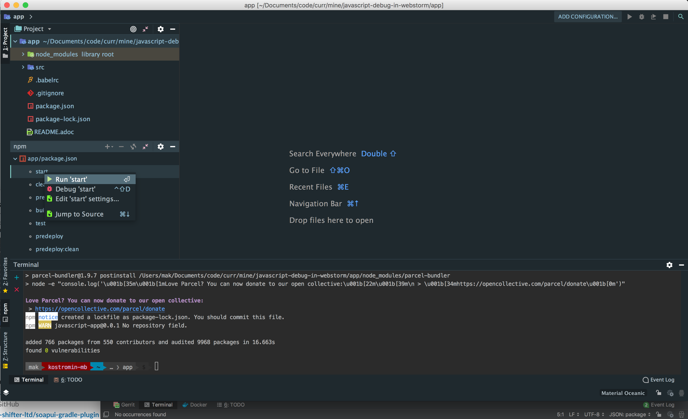
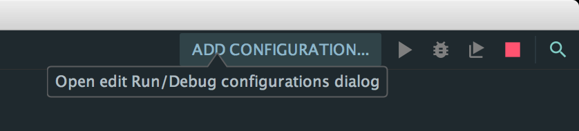
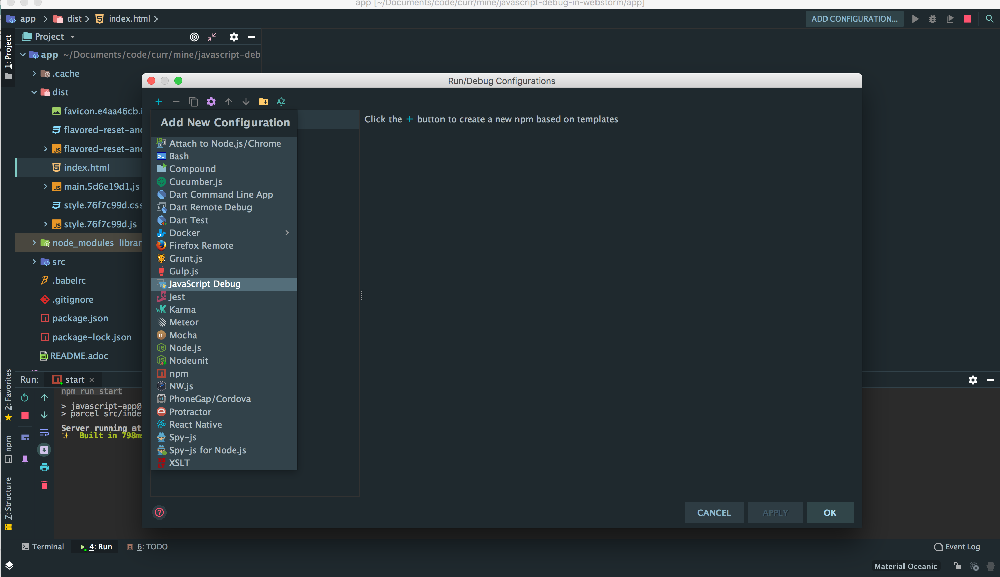
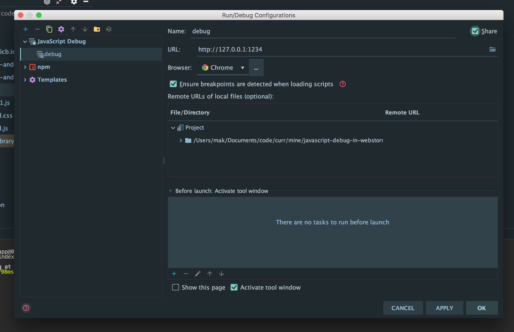
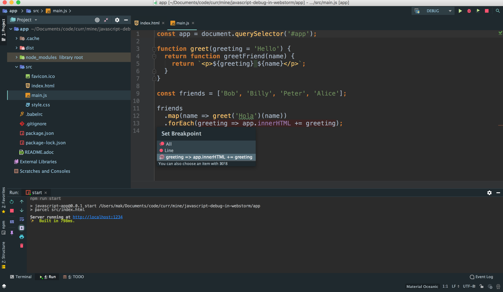
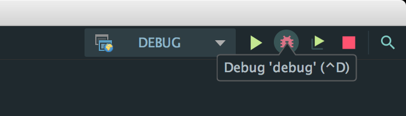
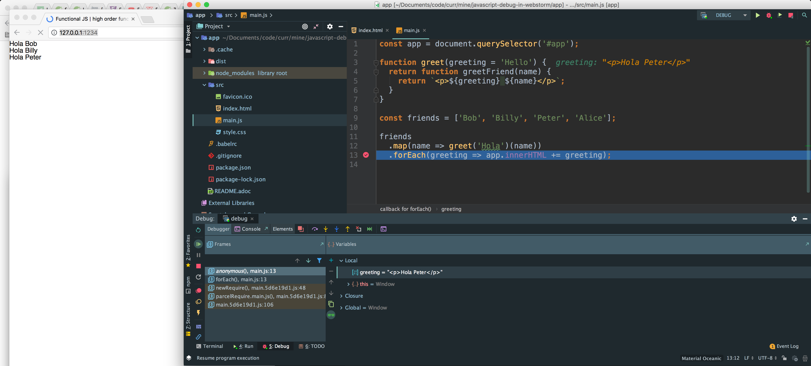

ifdef::backend-html5[]
= {root-project-name} ({project-version}) image:https://travis-ci.org/daggerok/{root-project-name}.svg?branch=master["Build Status", link={github-url}]
endif::backend-html5[]
ifndef::backend-html5[]
= {root-project-name} ({project-version})
endif::backend-html5[]

Maksim Kostromin <daggerok@gmail.com>
{docdatetime}
:doctype: book
:toc: left
:toclevels: 4
:numbered:
:icons: font
:hide-uri-scheme:
:revnumber: {project-version}
:example-caption!:
:source-highlighter: highlightjs

Travis CI status:
image:https://travis-ci.org/daggerok/{root-project-name}.svg?branch=master["Build Status", link={github-url}]

== Important: build app with source maps

[source,bash]
----
npm run build

tree ./dist
./dist
├── favicon.e4aa46cb.ico
├── flavored-reset-and-normalize.d19f0e53.css
├── flavored-reset-and-normalize.d19f0e53.js
├── flavored-reset-and-normalize.d19f0e53.map
├── index.html
├── main.5d6e19d1.js
├── main.5d6e19d1.map
├── style.76f7c99d.css
├── style.76f7c99d.js
└── style.76f7c99d.map

0 directories, 10 files
----

== Run app to be able debugger connect to it remotely

I'm using parcel, and running my app on port 1234

You can also simply use npm start from console...

== Create JavaScript debug configuration

and click OK

== Debugging

create a breakpoint somewhere in source code

run debug

and open according page in browser to si if you can debug you app

